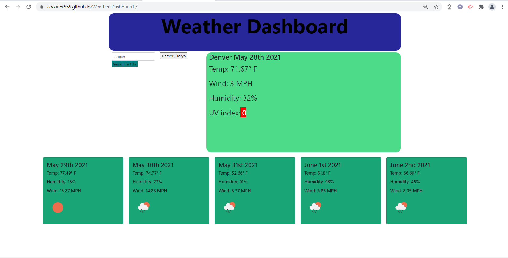

# Weather Dashboard

### Built With:
* JavaScript

* Weather Dashboard gives the user  current, up to date, weather information as well as a five-day forecast.

## Construction of the Landing Page: HTML, style.css, script.js
        
### HTML
* I created a basic index.html file that includes:
    * a boilerplate html.
    * a link to bootstrap. 
    * a link to moment.js for the dates that is to be rendured in the script.js file. 
    * a "container"  in which I used bootstrap:
    *   a Search bar. 
    *   5 cards for the five day forecast.
    *   a large card for the current weather.
* I created a div to create space for the buttons that would be generated from the Search history function.

### style.css
* I targted multiple classes in the HTML to change:
 *  Background colors
 *  Text size
 *  Font size
 *  Border styling
 *  Font Weight
 *  Margin
 *  Height

 ### script.js
 * I grabbed ID's and Class elements and stored them in variables.
 * I created a Search function. 
 * I added a click function event listener to the Search button.
 * I created a function to display the information for the 5 day forecast in the cards I created in the HTML using bootstrap.
     *  Inside this function a loop was necessary to get the information in sequential order according to the date. 

 * I created an input function that stores the input value of the user into a variable called cityName.
 * I excute the Search function.    
 * I created a history button that creates a button based of the user's search history. 
 * I created a fucntion to display the current weather on the display board. 

[Weather Dashboard](https://cocoder555.github.io/Weather-Dashboard-/)
